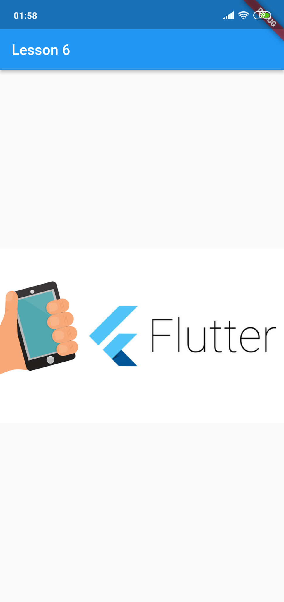

# INT3120 20 - Phat trien ung dung di dong
- Đây là repo báo cáo hằng tuần việc tự học Flutter

## Tuần 1
- Đã cài đặt thành công Flutter và android studio
- Chạy thử thành công Hello world theo hướng dẫn ở bài 3
## Tuần 2
- Học bài 6: Widget trong Flutter. Show thành công ra ảnh

